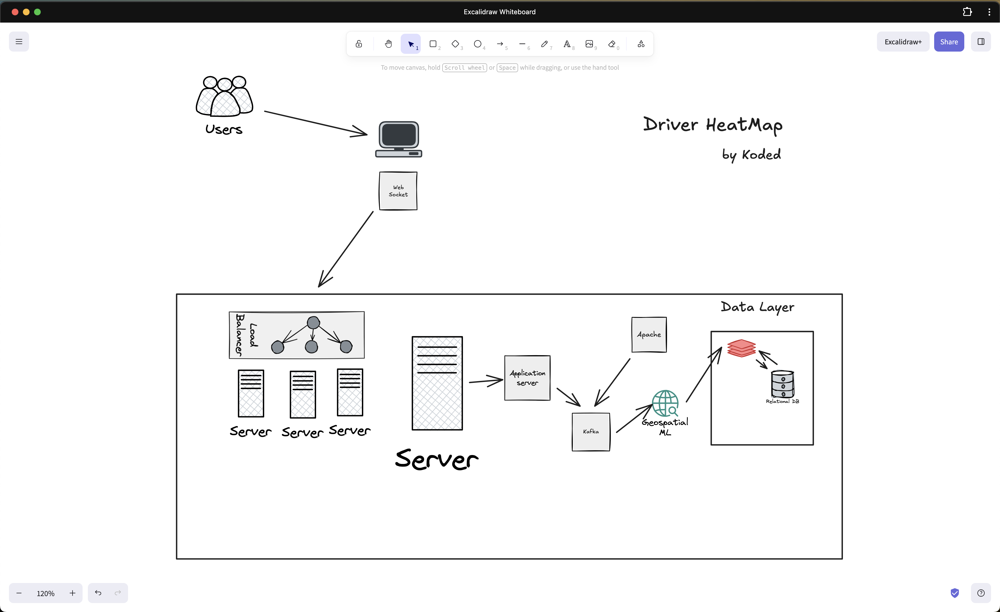

This README is where you explain that you didn't just build a "map"—you built a **high-throughput data pipeline**. Since you're skipping LeetCode to build actual systems, this README needs to scream "I understand scale."

Here is a revamped, high-octane version of your README.

---

# 🔥 Real-Time Driver Heatmap (Lagos)

**Forget LeetCode; let's build systems.** This project is a full-stack, real-time geospatial visualization engine designed to handle high-concurrency driver pings and transform them into a live demand heatmap.

The goal? Create "hype" and operational visibility by showing exactly where the action is happening across the city in real-time.

## 🛠 The Problem & The Solution

**The Challenge:** How do you process thousands of GPS pings per second from moving drivers and update a web map without crashing the database or lagging the UI?

**The Solution:**
Instead of a traditional "Save to DB -> Poll DB" approach, I built a **reactive stream**:

1. **Decoupling with Kafka:** Driver pings are offloaded immediately to a message broker. The API stays fast because it doesn't wait for processing.
2. **Geospatial Aggregation:** Used **Geohashes** to group coordinates into "buckets" in **Redis**. This reduces the data sent to the frontend from "thousands of points" to "density counts per area."
3. **Push, Don't Pull:** Used **WebSockets (Django Channels/Daphne)** to push updates to the map only when data changes.

---

## 🏗 System Architecture
* **Ingestion:** [Django REST Framework](https://www.google.com/search?q=backend/api/views.py) — Validates and pushes pings to Kafka.
* **Message Broker:** [Apache Kafka](https://www.google.com/search?q=backend/api/services/producers.py) — Buffers incoming location data.
* **State Store:** [Redis](https://www.google.com/search?q=backend/api/services/redis.py) — Stores aggregated geohash counts for sub-millisecond lookups.
* **The Bridge:** [Django Channels (ASGI)](https://www.google.com/search?q=backend/backend/asgi.py) — Manages persistent WebSocket connections.
* **Visualization:** [React + Leaflet.heat](https://www.google.com/search?q=frontend/src/components/MapView.jsx) — Decodes hashes and renders the "glow."

* **Infrasturcture Overview:** 

---

## 🚀 Key Implementation Details

### 1. Real-Time Processing

The [HeatMapConsumer](https://www.google.com/search?q=backend/api/services/consumers.py) handles the WebSocket lifecycle. It joins a broadcast group (`live_heatmap`) so that a single worker can update thousands of connected clients simultaneously.

### 2. Geohash Decoding

To keep the payload light, the backend sends geohash strings. The frontend uses a [Custom Hook](https://www.google.com/search?q=frontend/src/hooks/useHeatmapSocket.js) and `ngeohash` to decode these back into Lat/Lng coordinates on the fly.

### 3. Concurrency Management

Configured [Daphne](https://www.google.com/search?q=backend/backend/asgi.py) to handle the ASGI protocol, allowing the server to manage long-lived WebSocket connections while standard HTTP requests still flow through the REST API.

---

## 🚦 Getting Started

### Prerequisites

* Python 3.12+
* Node.js & NPM
* Redis (Running on `localhost:6379`)
* Kafka (Running on `localhost:9092`)

### Backend Setup

```bash
cd backend
python -m venv .venv
source .venv/bin/activate
pip install -r requirements.txt
python manage.py runserver

```

### Frontend Setup

```bash
cd frontend
npm install
npm run dev

```

---

## 📈 Future Roadmap

* [ ] **Dynamic Precision:** Adjust geohash length based on map zoom level.
* [ ] **Historical Replay:** Use PostGIS to store and "replay" peak hours.
* [ ] **Auth:** Secure the WebSocket connection with JWT.

---

**Built during a 6-hour flow state (8PM - 2AM). Far more satisfying than solving TwoSum.**

---